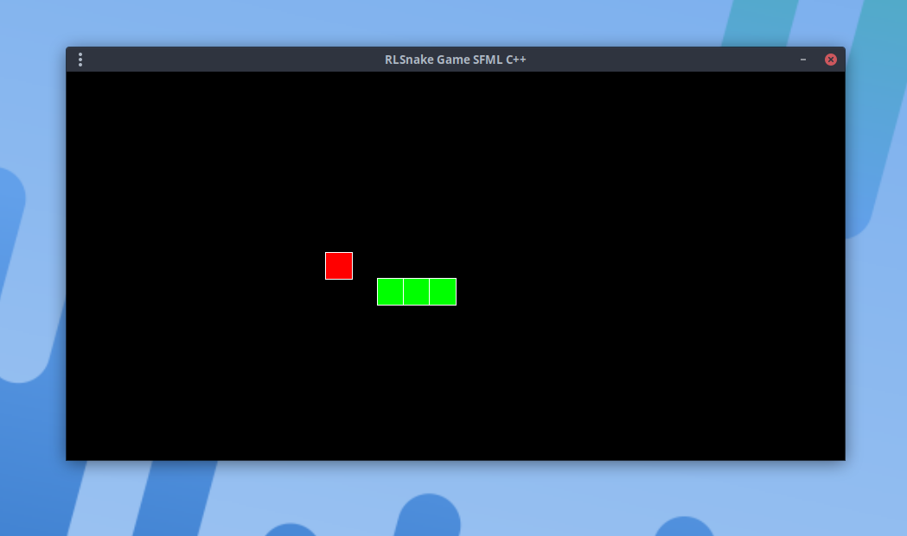

# RL Snake



Simple Snake Game in C++ with SFML
## How to compile this game
**Clone this repository**
```bash
$ git clone https://github.com/Renan2010/RLSnake.git
```
**Enter the directory**
```bash
$ cd RLSnake
```
**And run ninja to compile this game**
```bash
RLSnake$ ninja -j $(nproc)
```
**Execute 'RLsnake'**
```bash
RLSnake$ ./RLSnake
```
And enjoy :)
# FAQ
What is **'$(nproc)'**

'$(nproc)' is the total number of cores, plus the threads on your machine/PC, the more cores, the faster the compilation

For exanple:

My PC is an i5-2400 4C/4T
```bash
$ nproc
Output: 4
```
Other example AMD ryzen 9 9950x 16C/32T
```bash
$ nproc
Output: 32
```
in short, **'$(nproc)'** will take the cpu cores "automatically"
